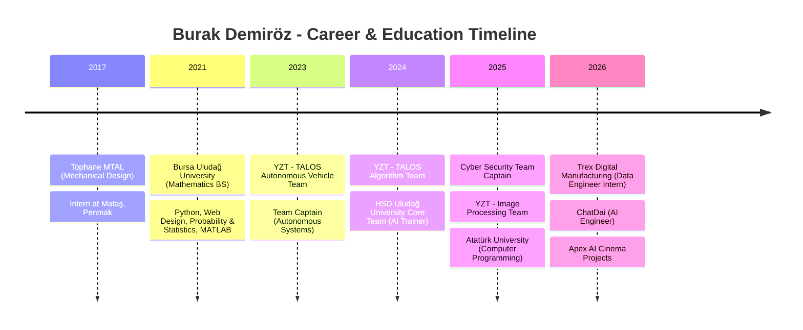

# 🚀 Burak Demiröz | AI Engineer & Full Stack Developer

  
  
  

---

## 🙋‍♂️ About Me

As an **Artificial Intelligence Engineer** and **Full Stack Developer**, I specialize in training machine learning models, designing autonomous vehicle algorithms, building data engineering pipelines, and developing AI-powered developer tools. I am passionate about creating innovative solutions that bridge the gap between mathematics, software engineering, and automation.

> [!NOTE]
> Currently working as an **AI Engineer at ChatDai** and **Data Engineer Intern at Trex Digital Manufacturing**.

---

## 🛠️ Core Focus & Tech Stack

### 🧠 Artificial Intelligence & Robotics
*   **Computer Vision & Deep Learning:** YOLOv8, OpenCV, TensorFlow, PyTorch
*   **Autonomous Systems:** Motion Planning (Pure Pursuit, PID), Path Planning (Dijkstra), Localization (EKF, Kalman Filter), Mapping (SLAM), Lidar Processing (DBSCAN Clustering), CAN-BUS
*   **AI Frameworks:** LLMs, RAG, Agentic Frameworks (Logchain.js, Ollama, vLLM)

### 💻 Software & Data Engineering
*   **Languages:** Python, JavaScript (Node.js), C, C++, C#
*   **Data & DevOps:** Docker, Data Pipelines, SQL, MATLAB, Maple
*   **Mechanical & CAD Design:** AutoCAD, Autodesk Inventor, Solidworks

---

## 🗺️ Experience & Education Timeline

Here is a visual timeline of my academic background, internships, and leadership roles:

---

## 📂 Featured Projects

### 🤖 AI-Powered Applications

#### **ChatDai** *(March 2026)*
*   **Stack:** Vision AI, Web Search, Transformers, Mathematics
*   **Description:** An advanced ChatGPT-like AI assistant capable of mathematical proofs, coding, regular web research, and comprehensive image reasoning.

#### **Apex AI Cinema** *(March 2026)*
*   **Stack:** AI Automation, Generative Media
*   **Description:** An AI-powered automated cinema platform for content generation and futuristic movie production.

#### **PhoeniX** *(September 2025)*
*   **Stack:** Node.js, Logchain.js, Ollama, vLLM, VS Code API
*   **Description:** A free desktop application running on top of VS Code that allows developers to select local agent models and write code with AI agents.

#### **MathPi** *(October 2025)*
*   **Stack:** Node.js, Logchain.js
*   **Description:** An AI-powered advanced mathematical computation chatbot with specialized agents that explore new resources for complex calculations, analyses, and theoretical mathematics.

---

### 🚗 Autonomous Systems & Algorithms
#### **TALOS Autonomous Vehicle Algorithms** *(2024 - 2025)*
*   **Stack:** Python, Docker, CAN-BUS
*   **Implemented Systems:**
    *   `YoloV8` - Traffic Sign Detection & Obstacle Detection
    *   `UltraFastLine` - Lane Detection & Lane Tracking
    *   `Dijkstra` - Path Planning & Route Optimization
    *   `DBSCAN` - Lidar Data Clustering & Obstacle Filtering
    *   `Pure Pursuit & PID` - Lateral and Longitudinal Vehicle Control
    *   `EKF & SLAM` - Vehicle Localization and Mapping

---

### 🔒 Cybersecurity & CTF Projects
*   **CVE-2025-2082 (Tesla CAN-BUS Vulnerability):** Python/CAN-BUS implementation explaining Tesla CAN-BUS system vulnerability scenarios.
*   **DemirozBank (Banking Vulnerability Lab):** A vulnerable banking web application developed for CTF training (Python, Docker, Web Security).
*   **Lokman Hekim (Doctor AI):** An AI agent providing ancient health advice, built for the YZT-CTF competition.

---

## ⚙️ Obsidian Agent Skills Integration

This repository is optimized for autonomous AI agents using the **Open Agent Skills Ecosystem**. The following agent capabilities are installed:

*   **`obsidian-markdown`:** Full support for Obsidian-flavored syntax, including internal `[[wikilinks]]`, image/PDF embeds, and complex callouts.
*   **`obsidian-vault`:** Configured with specific vault patterns (flat note layout, Title Case naming, Index aggregation).
*   **`json-canvas`:** Full integration for generating and editing interactive Obsidian Canvas (`.canvas`) files.

---

## 📬 Contact & Connect

*   **Email:** [burakdemirozis16@gmail.com](mailto:burakdemirozis16@gmail.com)
*   **Location:** Bursa, Turkey 🇹🇷
*   **Language Proficiency:** English (B1)

---

  <i>© 2025-2026 Burak Demiröz. All rights reserved.</i>

