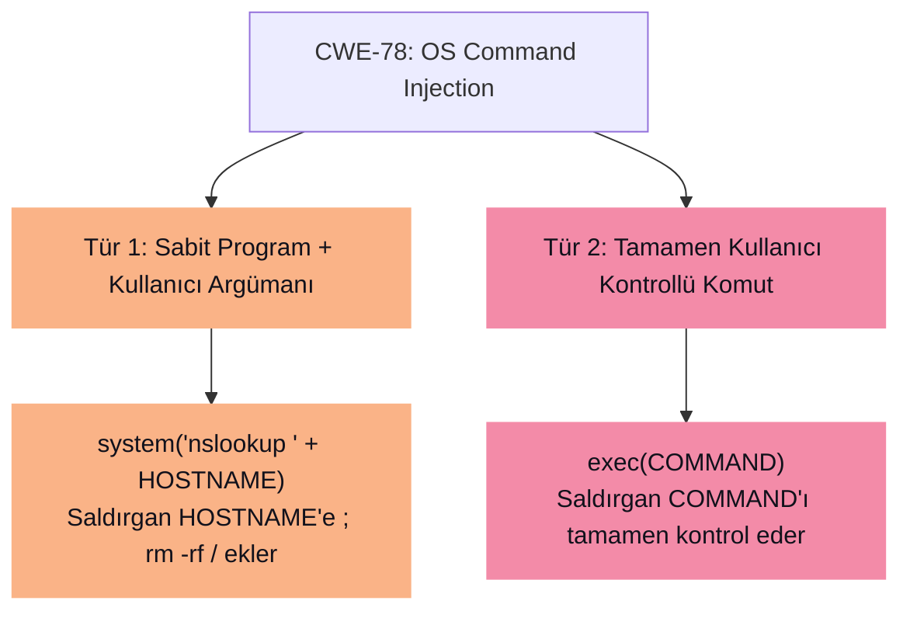
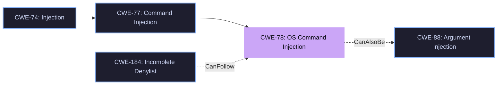

# ⚡ CWE-78: OS Command Injection

> [!abstract] Tanım
> Uygulama, dış kaynaklı kullanıcı girdisini kullanarak bir **OS komutu** oluşturur; ancak komutun yapısını değiştirebilecek ==özel karakterleri nötralize etmez== veya yanlış nötralize eder. Bu durum saldırganın sunucuda rastgele komut çalıştırmasına olanak tanır.

| Alan | Detay |
| :--- | :--- |
| **CWE ID** | 78 |
| **Üst Sınıf** | [[CWE-77]] — Command Injection |
| **Abstraction** | Base |
| **Exploit Olasılığı** | ==High== |
| **OWASP Top 10** | A03:2021 — Injection |
| **Alternatif İsimler** | Shell Injection, Shell Metacharacters, OS Command Injection |

---

## 🔍 Detaylı Açıklama

Bu zafiyet, saldırganın işletim sistemine doğrudan erişimi olmadığı ortamlarda (özellikle web uygulamalarında) kritik bir tehlike oluşturur. Ayrıcalıklı bir programda meydana gelirse, saldırgan normalde erişemeyeceği komutları çalıştırabilir.

### İki Alt Türü Vardır



> [!info] Tür 1 — Sabit Program, Kullanıcı Argümanı
> Uygulama sabit bir programı (örn: `nslookup`) çalıştırır ve kullanıcıdan argüman alır. Saldırgan, programın çalışmasını engelleyemez ancak argümana **komut ayırıcıları** (`;`, `|`, `&&`) enjekte ederek kendi komutunu çalıştırabilir.

> [!danger] Tür 2 — Tamamen Kullanıcı Kontrollü Komut
> Uygulama, kullanıcının belirttiği komutu doğrudan işletim sistemine yönlendirir (`exec(COMMAND)`). Saldırgan, çalıştırılacak komutu tamamen kontrol eder.

---

## 💥 Olası Etkiler (Common Consequences)

| Etki | Scope |
| :--- | :--- |
| Yetkisiz kod/komut çalıştırma | Confidentiality, Integrity, Availability |
| Dosya okuma / değiştirme | Confidentiality, Integrity |
| Uygulama verisini okuma / değiştirme | Confidentiality, Integrity |
| Servis durdurma (DoS) | Availability |
| İzleri gizleme (anti-forensics) | Non-Repudiation |

> [!warning] Kritik Nokta
> Hedeflenen uygulama komutu doğrudan çalıştırdığı için, tüm kötü amaçlı faaliyetler ==uygulamanın kendisinden geliyormuş gibi== görünür.

---

## 📋 Gerçek Dünya Örnekleri (Demonstrative Examples)

### Örnek 1 — PHP `system()` ile Dizin Listeleme

> [!example]- PHP Zafiyetli Kod
> ```php
> // ❌ Zafiyetli
> $userName = $_POST["user"];
> $command = 'ls -l /home/' . $userName;
> system($command);
> ```
> **Saldırı:** `$userName = ";rm -rf /"` → Tüm dosya sistemi silinir.
> ```
> ls -l /home/;rm -rf /
> ```

### Örnek 2 — C `system()` ile setuid Programı

> [!example]- C Zafiyetli Kod
> ```c
> // ❌ Zafiyetli - setuid root ile çalışıyor
> int main(int argc, char** argv) {
>     char cmd[CMD_MAX] = "/usr/bin/cat ";
>     strcat(cmd, argv[1]);
>     system(cmd);
> }
> ```
> **Saldırı:** `argv[1] = ";rm -rf /"` → Root yetkileriyle dosya sistemi silinir.

### Örnek 3 — Perl DNS Lookup

> [!example]- Perl Zafiyetli Kod
> ```perl
> # ❌ Zafiyetli
> $name = param('name');
> $nslookup = "/path/to/nslookup";
> open($fh, "$nslookup $name|");
> ```
> **Saldırı:** `name = "cwe.mitre.org ; /bin/ls -l"` → Dizin listelenir.

### Örnek 4 — Java `Runtime.exec()` ile Backup

> [!example]- Java Zafiyetli Kod
> ```java
> // ❌ Zafiyetli
> String btype = request.getParameter("backuptype");
> String cmd = "cmd.exe /K \"c:\\util\\rmanDB.bat " + btype 
>              + "&&c:\\utl\\cleanup.bat\"";
> Runtime.getRuntime().exec(cmd);
> ```
> **Saldırı:** `btype = "& del c:\\dbms\\*.*"` → Veritabanı dosyaları silinir.

---

## 🛡️ Önleme Stratejileri (Mitigations)

### Mimari & Tasarım Aşaması

> [!tip] 1. Kütüphane Çağrıları Kullan
> Dış süreç çalıştırmak yerine, aynı işlevselliği sağlayan ==kütüphane fonksiyonlarını== tercih et.

> [!tip] 2. Parametrize Edilmiş Fonksiyonlar Kullan
> Tek bir string alan fonksiyonlar yerine, argümanları ayrı ayrı alan fonksiyonları kullan:
> ```python
> # ❌ Zafiyetli (tek string, shell üzerinden)
> os.system("nslookup " + hostname)
> 
> # ✅ Güvenli (argümanlar ayrı, shell yok)
> subprocess.run(["nslookup", hostname], shell=False)
> ```

> [!tip] 3. Sandbox / Jail
> Kodu `chroot`, AppArmor veya SELinux gibi sandbox ortamlarında çalıştır.

### Uygulama (Implementation) Aşaması

> [!tip] 4. Input Validation (Whitelist)
> **"Accept known good"** stratejisi uygula. Girdinin yalnızca beklenen formata uymasını zorunlu kıl:
> ```python
> import re
> if not re.match(r'^[a-zA-Z0-9.\-]+$', hostname):
>     raise ValueError("Geçersiz hostname")
> ```

> [!tip] 5. Output Encoding / Escaping
> Özel karakterleri (`; | & $ > <`) doğru şekilde escape et. En güvenli yaklaşım: alfanümerik olmayan her şeyi filtrele.

### Operasyon Aşaması

> [!tip] 6. En Az Yetki İlkesi (Least Privilege)
> Uygulamayı ==minimum yetki== ile çalıştır. Veritabanı uygulamaları `root` veya `admin` olarak çalışmamalıdır.

> [!tip] 7. Uygulama Güvenlik Duvarı (WAF)
> Kod düzeltilemiyorsa, saldırı tespit eden bir uygulama güvenlik duvarı kullan (acil önlem).

---

## 🗂️ İlişkili Zafiyetler



| İlişki | CWE | Açıklama |
| :--- | :--- | :--- |
| **ChildOf** | CWE-77 | Command Injection (üst sınıf) |
| **CanAlsoBe** | CWE-88 | Argument Injection (argüman enjeksiyonu) |
| **CanFollow** | CWE-184 | Eksik denylist sonucu tetiklenebilir |

---

## 🔎 Tespit Yöntemleri

| Yöntem | Etkililik |
| :--- | :--- |
| Automated Static Analysis (kaynak kod) | ==High== |
| Manual Source Code Review | ==High== |
| Binary / Bytecode Analysis | ==High== |
| Fuzz Testing (fuzzing) | Moderate |
| Web Application Scanner | Partial |
| Architecture / Design Review | ==High== |

---

## 📌 Seçilmiş CVE Örnekleri

| CVE | Açıklama |
| :--- | :--- |
| CVE-2024-53899 | Sanal ortam builder'da magic template stringleri doğru quote edilmiyor |
| CVE-2025-44844 | Dosya yükleme işlevinde Content-Disposition header ile OS command injection |
| CVE-2024-6091 | AI agent platformunda `/./ ` dizisi ile eksik denylist → command injection |
| CVE-2024-52803 | LLM platformunda eğitim sırasında `Popen` ile güvensiz komut çalıştırma |
| CVE-2020-10987 | Wi-Fi router'da OS command injection (CISA KEV) |
| CVE-1999-0067 | Klasik örnek: CGI programında `\|` metacharacter nötralize edilmiyor |

---

> [!quote] Kaynak
> [MITRE CWE-78](https://cwe.mitre.org/data/definitions/78.html) — Son güncelleme: April 30, 2026
