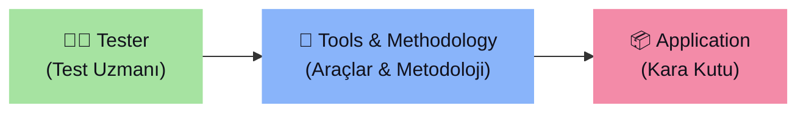
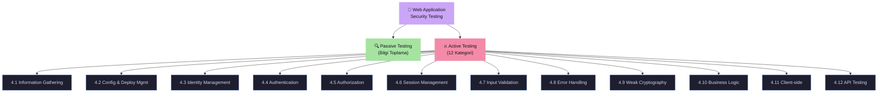

# 🎯 WSTG 4.0 — Introduction and Objectives

> [!abstract] Özet
> Bu bölüm OWASP web uygulama güvenlik test metodolojisini tanımlar ve tespit edilen güvenlik kontrollerindeki eksikliklere bağlı zafiyetlerin nasıl test edileceğini açıklar.

---

## 📖 Temel Kavramlar

| Kavram | Tanım |
| :--- | :--- |
| **Güvenlik Testi** | Uygulama güvenlik kontrollerinin etkinliğini ==sistematik olarak doğrulama== yöntemi |
| **Zafiyet (Vulnerability)** | Sistemin tasarımı, uygulaması, işletimi veya yönetimindeki bir **kusur veya zayıflık** |
| **Tehdit (Threat)** | Bir zafiyeti istismar ederek uygulamanın varlıklarına zarar verebilecek ==her şey== (kötü niyetli saldırgan, iç kullanıcı, sistem kararsızlığı vb.) |
| **Test** | Bir uygulamanın paydaşlarının güvenlik gereksinimlerini karşıladığını göstermeye yönelik ==eylem== |

---

## 🏗️ OWASP Yaklaşımı

> [!info] Açık ve İşbirlikçi
> - **Açık:** Her güvenlik uzmanı deneyimiyle katkıda bulunabilir. Her şey ücretsizdir.
> - **İşbirlikçi:** Makaleler yazılmadan önce beyin fırtınası yapılır; ekip fikirleri paylaşır ve kolektif bir vizyon geliştirir.

Bu yaklaşımın sonuçları:

| Özellik | Açıklama |
| :--- | :--- |
| **Tutarlı** (Consistent) | Her test aynı standardı izler |
| **Tekrarlanabilir** (Reproducible) | Sonuçlar yeniden üretilebilir |
| **Titiz** (Rigorous) | Kapsamlı ve ayrıntılı |
| **Kalite Kontrollü** | Her sorun belgelenir ve test edilir |

---

## 🔬 OWASP Test Metodolojisi

> [!important] Kara Kutu Yaklaşımı
> OWASP Web Application Security Testing metodolojisi ==kara kutu (black box)== yaklaşımına dayanır. Test uzmanı, test edilecek uygulama hakkında çok az bilgiye sahiptir veya hiç bilgisi yoktur.

### Test Modeli



---

## 🔄 Test Türleri

### 1. Pasif Test (Passive Testing)

> [!note] Gözlem ve Keşif
> Test uzmanı, uygulamanın mantığını anlamaya çalışır ve bir son kullanıcı gibi uygulamayı keşfeder. HTTP(S) proxy gibi araçlar bilgi toplama için kullanılır.

**Bu aşamada belirlenenler:**
- HTTP header'lar, parametreler, cookie'ler
- API'ler ve teknoloji kalıpları
- Tüm erişim noktaları ve işlevsellikler

> [!example]- Pasif Test Örnekleri
> **Örnek 1 — Kimlik Doğrulama Formu Keşfi:**
> ```
> https://www.example.com/login/auth_form
> ```
> → Kullanıcı adı ve şifre isteyen bir kimlik doğrulama formu.
> 
> **Örnek 2 — Erişim Noktalarının Tespiti:**
> ```
> https://www.example.com/appx?a=1&b=1
> ```
> → İki erişim noktası: `a` ve `b` parametreleri → ==test hedefleri==.

---

### 2. Aktif Test (Active Testing)

> [!danger] 12 Test Kategorisi
> Aktif testler aşağıdaki 12 kategoriye ayrılmıştır:

| # | Kategori | Açıklama |
| :--- | :--- | :--- |
| **4.1** | Information Gathering | Bilgi toplama ve keşif |
| **4.2** | Configuration & Deployment Management | Yapılandırma ve dağıtım yönetimi testi |
| **4.3** | Identity Management | Kimlik yönetimi testi |
| **4.4** | Authentication Testing | Kimlik doğrulama testi |
| **4.5** | Authorization Testing | Yetkilendirme testi |
| **4.6** | Session Management | Oturum yönetimi testi |
| **4.7** | Input Validation | Girdi doğrulama testi |
| **4.8** | Error Handling | Hata yönetimi testi |
| **4.9** | Weak Cryptography | Zayıf kriptografi testi |
| **4.10** | Business Logic | İş mantığı testi |
| **4.11** | Client-side Testing | İstemci tarafı testi |
| **4.12** | API Testing | API testi |



---

> [!quote] Kaynak
> [OWASP WSTG — 4.0 Introduction and Objectives](https://owasp.org/www-project-web-security-testing-guide/latest/4-Web_Application_Security_Testing/) — OWASP Foundation
