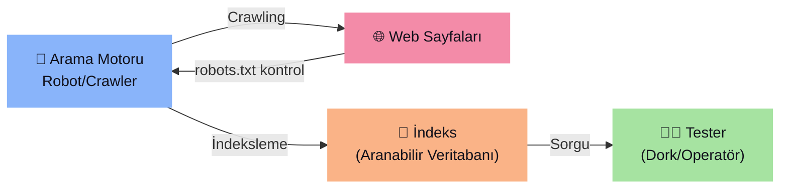

# 🔍 WSTG-INFO-01 — Search Engine Discovery Reconnaissance

> [!abstract] Özet
> Arama motorlarının indekslediği bilgileri kullanarak, hedef uygulama/organizasyon hakkında ==hassas tasarım ve yapılandırma bilgilerinin== sızıp sızmadığını tespit etme tekniğidir.

| Alan | Detay |
| :--- | :--- |
| **WSTG ID** | WSTG-INFO-01 |
| **Kategori** | 4.1 — Information Gathering |
| **Yöntem** | Pasif Test |

---

## 🎯 Test Hedefleri

1. Organizasyonun sitesinde **doğrudan** ifşa edilen hassas tasarım/yapılandırma bilgilerini tespit et
2. Üçüncü parti hizmetler aracılığıyla **dolaylı** olarak ifşa edilen bilgileri tespit et

---

## 🔬 Nasıl Çalışır?



> [!info] Crawling Süreci
> Arama motorları, robotlar aracılığıyla milyarlarca sayfadan veri toplar. Bağlantıları takip ederek veya sitemap'leri okuyarak içerik ve işlevsellik keşfeder. `robots.txt` dosyasında listelenen sayfalar göz ardı edilir — ancak bu dosya güncellenmezse, sahiplerin istemediği içerikler de indekslenebilir.

---

## 🔎 Aranacak Hassas Bilgiler

> [!danger] Ne Aranmalı?
> - Ağ diyagramları ve yapılandırmaları
> - Yöneticilerin arşivlenmiş gönderileri ve e-postaları
> - Oturum açma prosedürleri ve kullanıcı adı formatları
> - ==Kullanıcı adları, şifreler ve özel anahtarlar==
> - Üçüncü parti veya bulut servis yapılandırma dosyaları
> - Bilgi veren hata mesajı içerikleri
> - Halka açık olmayan uygulamalar (dev, test, UAT, staging)

---

## 🌐 Arama Motorları

> [!warning] Tek Motorla Sınırla Kalma
> Farklı motorlar farklı sonuçlar üretir (crawl zamanlaması ve algoritma farklılıkları nedeniyle).

| Motor | Açıklama |
| :--- | :--- |
| [**Google**](https://www.google.com) | Dünyanın en popüler arama motoru, gelişmiş operatör desteği |
| [**Bing**](https://www.bing.com) | Microsoft'un arama motoru, gelişmiş arama anahtar kelimeleri destekler |
| [**DuckDuckGo**](https://duckduckgo.com) | Gizlilik odaklı, birden fazla kaynaktan derleme yapar |
| [**Baidu**](https://www.baidu.com) | Çin'in en popüler arama motoru |
| [**Shodan**](https://www.shodan.io) | İnternete bağlı cihaz ve hizmetleri arar (IoT, sunucu, kamera vb.) |
| [**Censys**](https://search.censys.io) | Güvenlik odaklı; sunucular, sertifikalar ve açık servisleri indeksler |
| [**Common Crawl**](https://commoncrawl.org) | Herkesin erişebileceği açık web crawl veri deposu |
| [**Wayback Machine**](https://web.archive.org) | 1996'dan beri web sayfalarının tarihsel anlık görüntülerini arşivler |
| [**binsearch.info**](https://binsearch.info) | Binary Usenet newsgroup'ları için arama motoru |

---

## ⚙️ Search Operators (Arama Operatörleri)

> [!tip] Operatör Sözdizimi
> Genel format: `operatör:sorgu`

| Operatör | İşlev | Örnek |
| :--- | :--- | :--- |
| `site:` | Aramayı belirtilen domain ile sınırlar | `site:owasp.org` |
| `inurl:` | Yalnızca URL'de anahtar kelime içeren sonuçlar | `inurl:admin` |
| `intitle:` | Yalnızca sayfa başlığında anahtar kelime | `intitle:"index of"` |
| `intext:` | Yalnızca sayfa gövdesinde anahtar kelime | `intext:"password"` |
| `filetype:` | Belirli dosya türünü eşleştirir | `filetype:pdf` |

> [!example]- Örnek Kullanım
> ```
> site:owasp.org
> ```
> Bu sorgu, arama motorunun indekslediği tüm `owasp.org` içeriğini döndürür.

---

## 🕵️ Google Hacking / Dorking

Arama operatörlerini yaratıcı bir şekilde zincirleyerek hassas dosya ve bilgileri keşfetme tekniğidir.

> [!info] Kaynaklar
> - [**Google Hacking Database (GHDB)**](https://www.exploit-db.com/google-hacking-database) — Hazır dork kategorileri
> - [**DorkGPT**](https://dorkgpt.com) — Doğal dilden Google dork sözdizimi oluşturan AI aracı

### GHDB Dork Kategorileri

| Kategori | Açıklama |
| :--- | :--- |
| Footholds | İlk erişim noktaları |
| Files containing usernames | Kullanıcı adı içeren dosyalar |
| Sensitive Directories | Hassas dizinler |
| Web Server Detection | Web sunucu tespiti |
| Vulnerable Files | Zafiyetli dosyalar |
| Vulnerable Servers | Zafiyetli sunucular |
| Error Messages | Hata mesajları |
| Files containing juicy info | Değerli bilgi içeren dosyalar |
| Files containing passwords | Şifre içeren dosyalar |
| Sensitive Online Shopping Info | Hassas alışveriş bilgileri |

> [!example]- Örnek Dorklar
> ```
> site:example.com filetype:sql "password"
> site:example.com inurl:admin intitle:login
> site:example.com filetype:env "DB_PASSWORD"
> site:example.com filetype:log "error"
> intitle:"index of" "backup" site:example.com
> ```

---

## 🗄️ Arşiv ve Cache Servisleri

| Servis | Kullanım |
| :--- | :--- |
| [**Wayback Machine**](https://web.archive.org) | `https://web.archive.org/web/*/hedef.com` → Takvim görünümünde tüm anlık görüntüler |
| [**archive.ph**](https://archive.ph) | İsteğe bağlı kalıcı anlık görüntü oluşturma |
| [**CachedView**](https://cachedview.nl) | Google Cache, Wayback Machine vb. kaynaklardan cache birleştirme |

---

## 🔗 OSINT Korelasyon Araçları

> [!tip] Maltego
> Endüstri standardı OSINT ve bağlantı analizi platformu. Domain, IP, e-posta ve organizasyonlar arasındaki ilişkileri otomatik veri dönüşümleriyle haritalandırır. Tek bir varlıktan pivotlayarak ilişkili altyapıyı keşfeder.
> 
> 🆓 Ticari olmayan kullanım için **Community Edition** mevcuttur.

---

## 🛡️ Remediation (Düzeltme)

> [!success] Öneriler
> 1. Tasarım ve yapılandırma bilgilerini çevrimiçi yayınlamadan önce ==hassasiyetini dikkatle değerlendirin==
> 2. Mevcut çevrimiçi bilgilerin hassasiyetini ==periyodik olarak gözden geçirin==
> 3. `robots.txt` ve HTML meta tag'lerini güncel tutun
> 4. Arama motoru sağlayıcılarının sunduğu içerik kaldırma araçlarını kullanın

---

> [!quote] Kaynak
> [OWASP WSTG-INFO-01](https://owasp.org/www-project-web-security-testing-guide/latest/4-Web_Application_Security_Testing/01-Information_Gathering/01-Conduct_Search_Engine_Discovery_Reconnaissance_for_Information_Leakage) — OWASP Foundation
