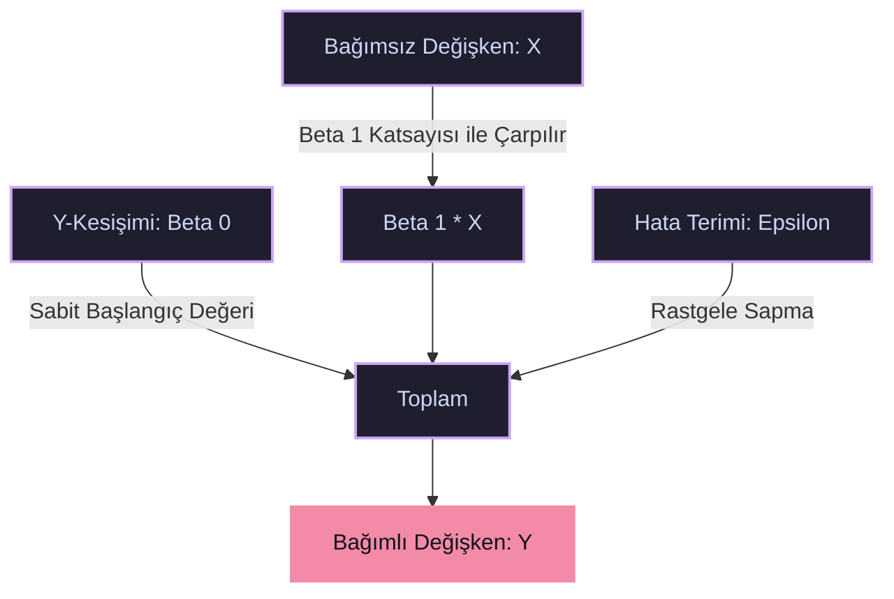

# 📉 Basit Doğrusal Regresyon (Simple Linear Regression)

> [!abstract] Kavramsal Özet
> Basit doğrusal regresyon, iki değişken arasındaki ilişkiyi anlamak ve modellemek için kullanılan en temel istatistiksel yöntemdir. Temel amacı, bir dağılım grafiğindeki veri noktalarının tam ortasından geçen, eğilimi en iyi yansıtan **"en iyi çizgiyi" (trend çizgisi)** çizmektir.
> 
> Bu çizgi sayesinde, elimizdeki verilere dayanarak gelecekteki veya elimizde olmayan durumlar için **tahmin (prediction)** yapabiliriz.

---

## 🔄 Değişkenler

| Değişken | Rolü | Tanım | Örnekler |
| :---: | :---: | :--- | :--- |
| **$X$** | Bağımsız Değişken (Predictor) | Etkileyen, kontrol ettiğimiz veya bildiğimiz değer. | Tecrübe Yılı, Reklam Bütçesi |
| **$Y$** | Bağımlı Değişken (Response) | Etkilenen, tahmin etmeye çalıştığımız değer. | Maaş, Satış Miktarı |

---

## 📐 Matematiksel İfade

Basit doğrusal regresyonun temel denklemi, bir doğru denklemidir ve şu şekilde ifade edilir:

$$Y = \beta_0 + \beta_1X + \epsilon$$

> [!info] Denklemdeki Terimlerin Anlamları
> *   **$Y$**: ==Bağımlı değişken== (Örn: Maaş).
> *   **$X$**: ==Bağımsız değişken== (Örn: Tecrübe yılı).
> *   **$\beta_0$ (Y-Kesişimi / Intercept)**: $X$ değeri $0$ olduğunda $Y$'nin aldığı değerdir. *(Hiç tecrübesi olmayan birinin başlangıç maaşı).*
> *   **$\beta_1$ (Eğim / Slope)**: $X$'teki 1 birimlik artışın, $Y$'de ne kadarlık bir değişime yol açtığını gösterir. *(Her 1 yıllık tecrübenin maaşa etkisi).*
> *   **$\epsilon$ (Hata Terimi / Error / Residual)**: Gerçek hayatta veriler asla kusursuz bir çizgi üzerinde dizilmez. Bu terim, çizdiğimiz doğrunun tahmin edemediği sapmaları *(gerçek değer ile tahmin edilen değer arasındaki farkı)* temsil eder.

### 📊 Doğrusal Regresyon Yapısı

---

## 🛠️ Peki Bu "En İyi Çizgi" Nasıl Bulunur? (En Küçük Kareler Yöntemi - OLS)

Regresyon çizgisini rastgele çizemeyiz. İstatistik, **"En Küçük Kareler Yöntemi" (Ordinary Least Squares - OLS)** denen bir teknik kullanır. Bu teknik, veri noktalarının çizdiğimiz doğruya olan uzaklıklarının (hataların) kareleri toplamını en aza indiren $\beta_0$ ve $\beta_1$ değerlerini hesaplar.

> [!tip] OLS'nin Amacı
> Tüm hataların karelerinin toplamını minimize et:
> 
> $$\min_{\beta_0, \beta_1} \sum_{i=1}^{n} \epsilon_i^2 = \min_{\beta_0, \beta_1} \sum_{i=1}^{n} (Y_i - (\beta_0 + \beta_1X_i))^2$$

---